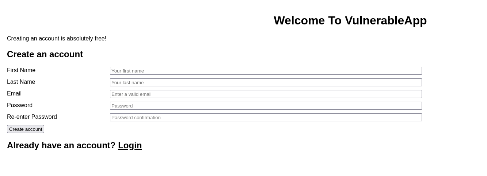
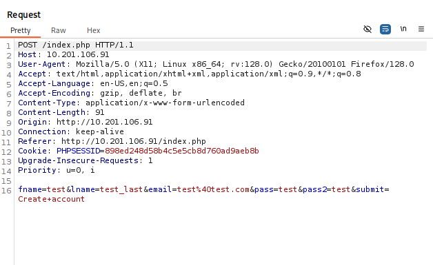
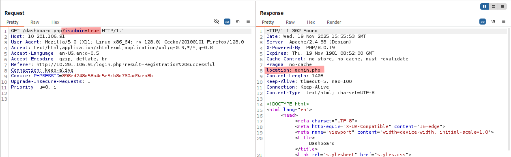
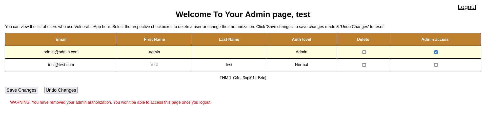
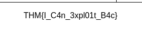

# Broken Access Control – TryHackMe Lab Writeup

## Overview
In this TryHackMe lab, I exploited a series of broken access control issues that allowed me to manipulate user roles, bypass authorization checks, and ultimately access administrative functionality without legitimate permissions. By intercepting requests and modifying key parameters, I was able to escalate privileges and retrieve the room’s final flag.

---

## Objectives
- Identify missing or weak access control mechanisms  
- Manipulate request parameters to change authorization behavior  
- Escalate a normal user account into an admin account  
- Validate the vulnerability by accessing admin-only functionality  
- Retrieve the final flag  

---

## Tools Used
- **Burp Suite Community Edition**  
- **Firefox**  
- **HTTP Request Tampering**  
- **Basic Recon / Parameter Manipulation**  

---

## Methodology

### **1. Completing Initial User Registration**
I began by creating a standard user account (`test@test.com`) through the registration form.



Burp Suite captured the POST request containing account creation parameters:



---

### **2. Logging In as the Normal User**
After registering, I logged in using the new credentials.


The application redirected my session to:

```
dashboard.php?isadmin=false
```

This parameter (`isadmin`) immediately suggested a potential access control weakness.

---

### **3. Intercepting and Modifying the Dashboard Request**
I intercepted the GET request used for dashboard loading:

```
GET /dashboard.php?isadmin=false HTTP/1.1
```

I changed the parameter to:

```
GET /dashboard.php?isadmin=true
```

Here is the Burp capture showing the exact parameter tampering:



The server responded with an HTTP **302 redirect** to:

```
admin.php
```

This confirmed that the server was relying entirely on a **client-controlled parameter** (`isadmin`) for access control.

---

### **4. Accessing the Admin Panel**
After the redirect, I gained full access to the application’s admin page.



Here, I could:

- View all existing users  
- Modify their authorization levels  
- Delete accounts  
- Grant myself admin access  

The application treated me as an administrator even though my user account was created as a normal user.

---

### **5. Retrieving the Final Flag**
The admin panel displayed the final room flag:

```
THM{!_C4n_3xpl01t_B4c}
```



This validated successful exploitation of Broken Access Control.

---

## Impact Analysis
This vulnerability allowed me to:

- Escalate privileges from a standard user to admin  
- Access sensitive administrative functionality  
- Modify or delete user accounts  
- Potentially take full control of the application  

Severity: **Critical**

Because:

- No server-side authorization checks existed  
- Privilege level was controlled entirely by a user-supplied parameter  
- A malicious attacker could take over the entire application with one modified request  

---

## Root Cause
- **Authorization decision made on the client side**  
- Application trusted the `isadmin` parameter from URL  
- No session-based role validation  
- No access-control enforcement on the server side  

---

## Mitigation Recommendations
- Validate user roles strictly on the **server side**  
- Store role information in server-side sessions, not URL parameters  
- Remove or sanitize any sensitive GET parameters  
- Enforce access rules using ACLs or middleware  
- Add logging and monitoring for abnormal privilege changes  

---

## Conclusion
This TryHackMe lab clearly demonstrated how insecure access control can allow a regular user to escalate privileges and take over the application entirely. By modifying a single request parameter (`isadmin`), I gained full administrative access and retrieved the final flag. This reinforces why access control must always be enforced server-side and must never rely on values supplied by the client.

