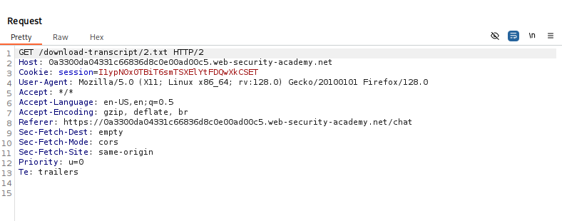
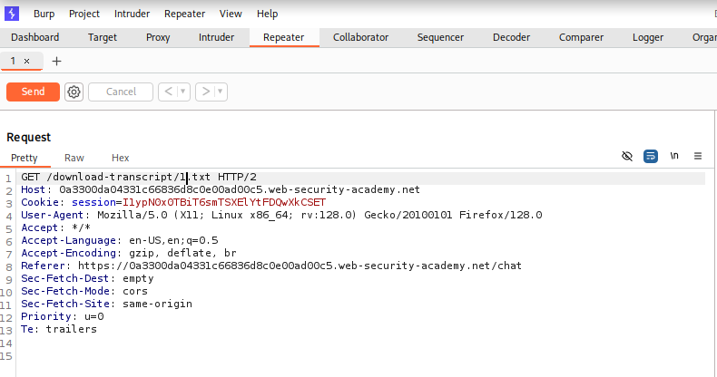
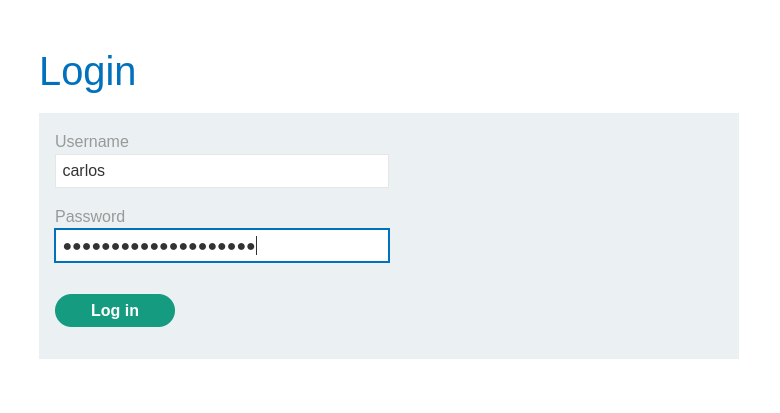
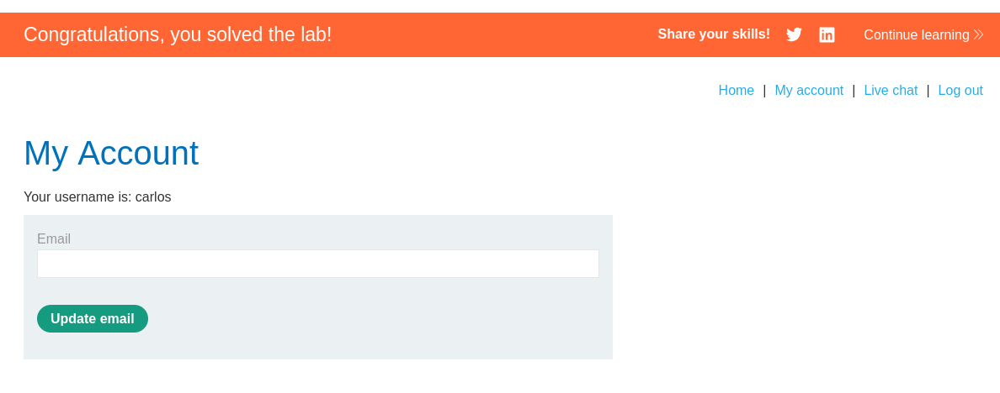

# Broken Access Control – Unprotected File Access (PortSwigger Lab Writeup)

## Overview
In this lab, I exploited an **Insecure Direct Object Reference (IDOR)** vulnerability that allowed me to access private chat transcripts by modifying a filename parameter in a GET request. By enumerating internal files, I was able to retrieve sensitive information, including a user’s plain-text password, and use it to compromise their account.

---

## Objective
- Identify and exploit an insecure direct file-access mechanism  
- Manipulate file identifiers to access unauthorized transcripts  
- Use leaked credentials to gain access to the victim’s account  

---

## Tools Used
- Burp Suite Community Edition  
- Firefox Browser  
- Manual HTTP Request Tampering  

---

## Methodology

### 1. Intercepting a Valid File Download Request
I began by capturing a legitimate transcript download request while authenticated.



The request referenced a predictable file (`2.txt`) without any authorization checks.

---

### 2. Finding a User-Controlled Parameter
The filename in the request was directly user-controlled.  
No authorization checks, hashing, or secure identifiers were used.  
This indicated a classic **IDOR / Unprotected File Access** vulnerability.

---

### 3. Modifying the File Identifier via Burp Repeater
I sent the request to Burp Repeater and modified the filename from `2.txt` to `1.txt`:

```
GET /download-transcript/1.txt HTTP/2
```



---

### 4. Accessing an Unauthorized Transcript
I received a **HTTP/2 200 OK** response containing the full chat transcript.


The transcript contained sensitive information, including a **plain-text password**:

```
You: Ok so my password is i39cot7dqbl0rttxbpy. Is that right?
Hal Pline: Yes it is!
```

This confirmed unauthorized file access.

---

### 5. Using the Leaked Credentials to Log In
With the extracted credentials:

- **Username:** carlos  
- **Password:** i39cot7dqbl0rttxbpy  

I was able to successfully log into the victim’s account.



---

### 6. Verifying Full Account Compromise (Lab Solved)
After logging in as Carlos, the lab confirmed that the attack was successful.



---

## Impact Analysis
This vulnerability allowed me to:

- Access internal chat transcripts belonging to other users  
- Read sensitive information including passwords  
- Fully compromise another user’s account  
- Potentially escalate to broader lateral movement  

Severity: **High**

---

## Root Cause
- Direct object references without authorization  
- Predictable file naming (`1.txt`, `2.txt`, etc.)  
- Sensitive information stored in plain text  

---

## Mitigation Recommendations
- Enforce permission checks before serving any resource  
- Use unpredictable identifiers (e.g., UUIDs) instead of sequential names  
- Ensure users can only access resources tied to their account  
- Never store passwords or sensitive user data in plain text  
- Add monitoring and rate-limiting for suspicious sequential file access  

---

## Conclusion
By modifying a single numeric parameter in a file download request, I was able to retrieve private transcripts, extract a user’s password, and fully compromise their account. This lab demonstrates how dangerous weak access control mechanisms can be and highlights the importance of robust authorization checks.

